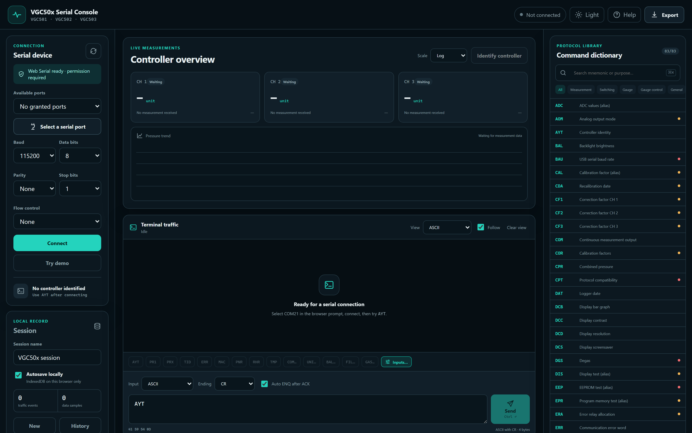
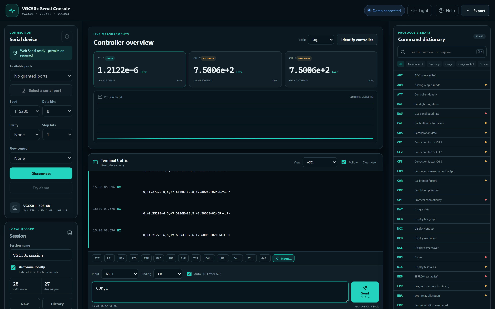
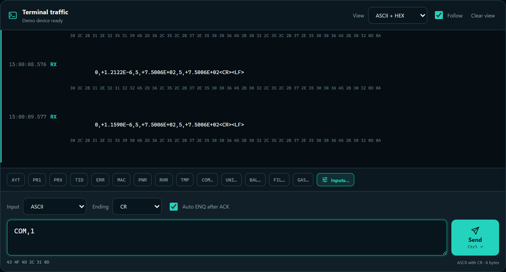
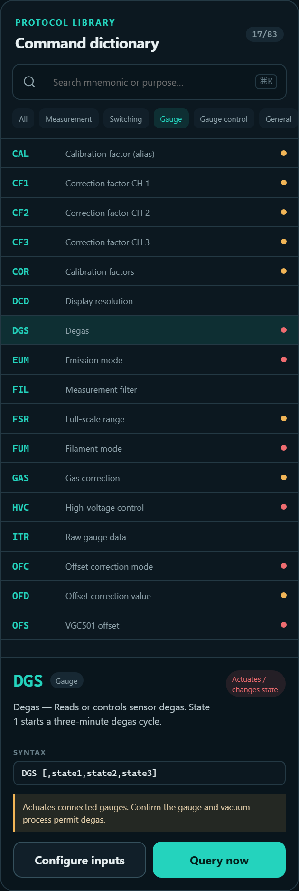
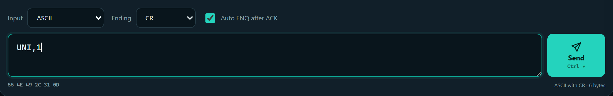
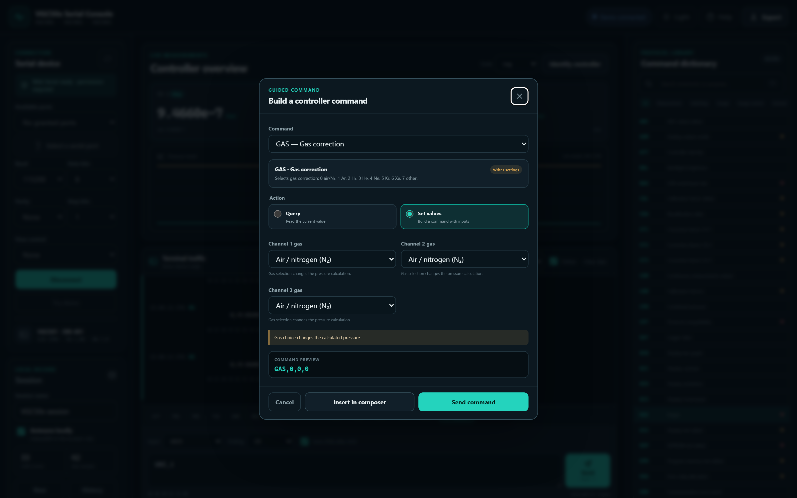
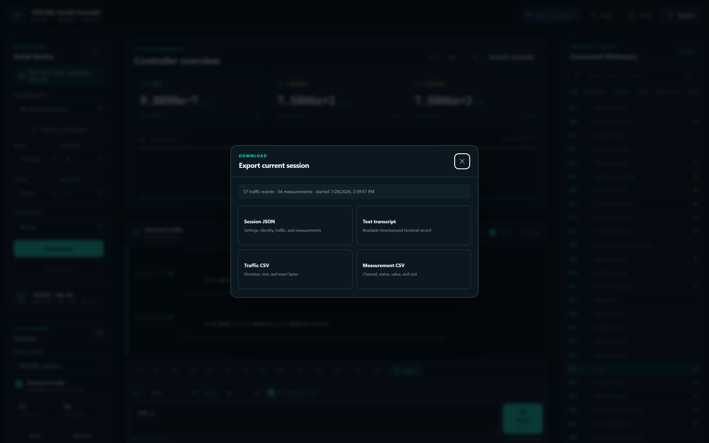

# VGC Serial Communicator

A local-first, browser-based serial console for **INFICON vacuum gauge controllers**. It talks
to a controller directly from Chrome or Microsoft Edge using the [Web Serial API](https://developer.mozilla.org/docs/Web/API/Web_Serial_API) —
no drivers, no installer, and no data leaves your machine. Connect a controller, let the app
identify it automatically, watch live pressure readings, send commands from a searchable protocol
dictionary, and export the whole session.

> **Local-first by design.** Serial traffic and saved sessions live only in the browser profile on
> the machine you run it on. This application never uploads them.



---

## Table of contents

- [Highlights](#highlights)
- [Supported controllers](#supported-controllers)
- [Requirements](#requirements)
- [Quick start](#quick-start)
- [Using the app](#using-the-app)
  - [Connecting](#connecting)
  - [Automatic identification](#automatic-identification)
  - [Live measurements](#live-measurements)
  - [Terminal traffic](#terminal-traffic)
  - [Command dictionary](#command-dictionary)
  - [Sending commands](#sending-commands)
  - [Input formats & line endings](#input-formats--line-endings)
  - [Sessions, autosave & export](#sessions-autosave--export)
- [Protocol notes](#protocol-notes)
- [Project structure](#project-structure)
- [npm scripts](#npm-scripts)
- [Deployment](#deployment)
- [Extending: the controller adapter framework](#extending-the-controller-adapter-framework)
- [Safety](#safety)
- [License](#license)

---

## Highlights

- **Zero-install operation** — double-click a launcher (or run one npm script) and the console opens
  in your default browser at `http://localhost`.
- **Automatic controller identification** — after you connect, the app sends only read-only probe
  commands and reports the first *verified* controller identity.
- **Live measurement dashboard** — up to three channels with status, value, and unit, plus a
  pressure trend chart with log/linear scaling.
- **Full-featured terminal** — ASCII, HEX, or combined views; follow-tail; timestamped, direction-
  tagged traffic with exact byte capture.
- **Searchable command dictionary** — every mnemonic with syntax, response format, example,
  category, risk level, and cautions.
- **Guided command builder** — form-driven inputs for parameterized commands, with a live byte
  preview before you send.
- **Flexible input** — send ASCII, escaped text, hex bytes, decimal bytes, or Base64, with
  selectable line endings (CR / CR+LF / LF / none).
- **ACK/ENQ automation** — optional Auto ENQ answers a controller's `ACK` (`0x06`) with `ENQ`
  (`0x05`) for the VGC50x handshake.
- **Local session history** — autosave to IndexedDB, browse saved sessions, and import/export.
- **Export anything** — full JSON session, readable text transcript, raw-traffic CSV, or parsed
  measurement CSV.
- **Light & dark themes** — remembered per browser.
- **Extensible adapter framework** — add new controllers without touching the UI.

---

## Supported controllers

| Controller | Family  | Status       | Factory framing        | Notes |
|------------|---------|--------------|------------------------|-------|
| VGC501 / VGC502 / VGC503 | `VGC50x` | ✅ Complete | 115200, 8-N-1 | `AYT` → `ACK`/`ENQ` identity handshake |
| VGC031     | `VGC031` | ✅ Complete | 19200, 8-N-1, address `01` | `#`-prefixed commands, `*` responses, Torr |
| VGC083A / VGC083B | `VGC083` | ✅ Complete | 19200, 8-N-1, address `01` | `#`-addressed INFICON protocol; hot-cathode A/B are wire-identical and auto-ID together via `#01RF` |
| VGC083C    | `VGC083` | ✅ Complete | 19200, 8-N-1, address `01` | Cold-cathode variant; auto-ID via `#01IGS`, gated so it never claims a hot-cathode unit |
| VGC094     | `VGC094` | ✅ Complete | 115200, 8-N-1 | `AYT` → `ACK`/`ENQ` handshake; four channels (A1/A2/B1/B2); enable Auto ENQ |

Every registered adapter now probes and parses. Identity matchers are deliberately conservative:
each requires a model-specific signature under its own probe, so one controller is never mistaken
for another. VGC083A and VGC083B share identical firmware and cannot be told apart on the serial
interface, so they identify together as **VGC083A/B**; select commands by your degas type (A =
electron-bombardment, B = I²R resistive). See
[Extending](#extending-the-controller-adapter-framework) for the adapter framework.

Manufacturer references:
[VGC031 operating manual](https://www.inficon.com/media/9319/download/Operating-Manual-Vacuum-Gauge-Controller-VGC031.pdf?inline=true&language=en&v=1)
· [VGC50x operating manual](https://www.inficon.com/media/4375/download/Operating-manual-VGC50x.pdf?inline=true&language=en&v=3)

---

## Requirements

- **A Chromium-based browser with Web Serial support** — Google Chrome or Microsoft Edge (desktop).
  Firefox and Safari do not implement Web Serial. The page must be served from a secure context
  (`https://` or `http://localhost`), which the launcher handles for you.
- **Node.js LTS** (the launcher and dev server run on Node; developed against Node 20+/24).
- A serial connection to the controller — a physical RS232/RS485 adapter or an INFICON virtual COM
  port.

---

## Quick start

### Option A — double-click launcher (recommended)

From the project folder:

- **Windows:** double-click **`Launch VGC Communicator.cmd`**
- **macOS / Linux:** double-click **`Launch VGC Communicator.command`**
  (on macOS you may need to allow it once in *System Settings → Privacy & Security*), or run
  `bash "Launch VGC Communicator.command"` from a terminal.

The launcher installs dependencies on first run, starts the local server, and opens the console in
your default browser.

### Option B — npm

```bash
npm install        # first time only
npm run app        # installs (if needed), starts the server, opens the browser
# or, for the raw dev server:
npm run dev
```

Then open the URL printed in the terminal (defaults to `http://localhost`).

### No hardware? Try the demo

Click **Try demo** in the Connection panel to explore identification, live measurements, and the
terminal with simulated traffic — no controller required.

---

## Using the app

### Connecting

1. Open the app in Chrome or Edge over HTTPS or localhost.
2. Click **Select a serial port** and choose the controller's COM port from the browser's port
   picker. (Browsers deliberately require this click — a website cannot silently open a port.)
3. Set **Controller** to the model you connected so the app sends only that model's safe identity
   probes. Leave it at **Auto** only when the model is unknown and you want it to check every
   supported controller. Leave **Baud** at **Auto** to try the selected model's factory baud rate
   first, followed by every listed baud rate. Select a numeric baud rate to make one specific
   connection attempt. VGC031 defaults to **19200, 8 data bits, no parity, 1 stop bit**; VGC50x
   controllers commonly use **115200, 8-N-1**. Data bits, parity, stop bits, and flow control are
   all adjustable.
4. Click **Connect**.

Previously selected ports reappear in the **Saved serial ports** dropdown; use the refresh button
to re-scan. Web Serial does not expose the Windows COM assignment to a webpage, so the application
identifies a saved port by its USB vendor and product IDs when the browser provides them. Expand
**Manage saved port access** only when you need to revoke one permission or clear them all.

### Automatic identification

On connect, the app runs the selected controller's **read-only probe steps** and routes every
complete response line through the adapters' `identify()` matchers. With **Controller = Auto**,
it checks every supported controller; otherwise it sends probes only for the selected model.
With **Baud = Auto**, it tries the selected controller's documented factory baud rate first, then
each remaining value in the Baud list, reopening the same granted port at each rate until a
controller identity is verified:

- **VGC50x** — sends `AYT<CR>`, expects the controller's `ACK` then answers with `ENQ`, and reads
  the identity response (`VGC501,…`).
- **VGC031** — sends `#01VER<CR>` and requires the documented `05041` software part number, then
  It also accepts the installed-unit `002733-x` part number, then verifies with a
  `#01RD<CR>` pressure read.
- **VGC083A/B** — sends `#01RF<CR>` (get filament selection) and requires the hot-cathode
  `FIL SEL` response, then verifies with `#01RDCG1<CR>`.
- **VGC083C** — sends `#01IGS<CR>` (gated to its own probe) and requires the cold-cathode
  `IG_OFF`/`IG_ON` status response.
- **VGC094** — sends `AYT<CR>` (same `ACK`/`ENQ` handshake as VGC50x) and requires the
  `VGC094,398-401,…` identity, then verifies with a `PRX<CR>` all-channel read.

Identity matchers are deliberately conservative so one controller is never mistaken for another.
Use **Re-identify controller** after changing serial settings.

### Live measurements



- Up to **four channel cards** show status, value, unit, and age of the last reading (VGC094 uses
  all four: A1, A2, B1, B2; other controllers use one to three).
- A **pressure trend** chart plots incoming samples with **Log** or **Linear** scaling.
- Status codes are decoded: `0` Okay, `1` Underrange, `2` Overrange, `3` Sensor error, `4` Sensor
  off, `5` No sensor, `6` Identification error, `7` Gauge error.
- Supported units: mbar, Torr, Pa, micron, hPa, Volt.

> Sending any command pauses automatic measurement streaming. Send `COM,1` to restore one-second
> continuous output on a VGC50x.

### Terminal traffic



- Switch the **View** between **ASCII**, **ASCII + HEX**, and **HEX**.
- **Follow** keeps the newest traffic in view; **Clear view** empties the on-screen feed (saved
  session data is untouched).
- Every event is timestamped, tagged by direction, and stores the exact bytes on the wire.

### Command dictionary



A searchable, categorized reference (Measurement, Switching, Gauge, Gauge control, General, Logger,
Transfer & test, Network). Select any command to see its **syntax, response format, example,
cautions, and risk level**. Search by mnemonic or purpose (⌘K / Ctrl-K focuses the box).

Each command carries a **risk label**:

- **safe** — read-only queries.
- **caution** — settings that affect measurement/interpretation.
- **danger** — actions that switch gauges, relays, emission, degas, calibration, addressing, baud,
  or reset. The UI flags these clearly before you send.

### Sending commands



- **Quick command** buttons send common mnemonics (`AYT`, `PR1`, `PRX`, `TID`, `ERR`, `MAC`, `PNR`,
  `RHR`, `TMP`) with one click. Buttons ending in **…** (`COM`, `UNI`, `BAL`, `FIL`, `GAS`) open a
  guided form.
- The **guided command builder** (**Inputs…**) turns parameterized commands into dropdowns and
  fields, shows a live command preview, and lets you either *Insert in composer* for review or
  *Send command* immediately.
- The **composer** shows a live **byte preview** and byte count as you type. Send with the button
  or **Ctrl + Enter**.



### Input formats & line endings

Choose how the composer interprets your input:

| Format | Example |
|--------|---------|
| ASCII | `SP1,2,1E-6,5E-6` |
| Escaped text | `AYT\r` or `<ENQ>` |
| Hex bytes | `41 59 54 0D` |
| Decimal bytes | `65, 89, 84, 13` |
| Base64 | `QVlUDQ==` |

Escaped mode understands `\r`, `\n`, `\t`, `\xNN`, and the tokens `<CR>`, `<LF>`, `<ENQ>`, `<ACK>`,
`<NAK>`, and `<ETX>`. Line endings are selectable: **CR**, **CR + LF**, **LF**, or **none**.

### Sessions, autosave & export



- Name the session and toggle **Autosave locally** (IndexedDB, this browser profile only).
- Live counters track traffic events and data samples.
- **History** lists saved sessions; **Import session JSON** loads a previously exported session.
- **Export** offers four formats:
  - **Session JSON** — settings, identity, traffic, and measurements.
  - **Text transcript** — readable, timestamped terminal record.
  - **Traffic CSV** — direction, text, and exact bytes.
  - **Measurement CSV** — channel, status, value, and unit.

Clearing the browser's site data also removes saved sessions.

---

## Protocol notes

**VGC50x — ACK / ENQ handshake**

```
HOST     AYT<CR>
VGC50x   <ACK><CR><LF>
HOST     <ENQ>
VGC50x   VGC501,…<CR><LF>
```

Most three-character mnemonics can be *queried* with no parameters or *set* by appending
comma-separated parameters. **Auto ENQ after ACK** watches for the `ACK` byte `0x06` and transmits
`ENQ` `0x05` automatically; `NAK` is `0x15`. Use `ERR` to read a syntax/parameter error after a
`NAK`.

**VGC031 — addressed ASCII**

Commands begin with `#`, responses begin with `*`, frames end in `CR`, and the factory address is
`01` (e.g. `#01RD<CR>` → `*01 y.yyEzpp`). Pressure is reported in Torr.

**VGC083 — addressed INFICON protocol**

The same `#aa…` / `*aa…` framing as VGC031 with the factory INFICON COM type. Read the ion gauge
with `#01RDIG<CR>` and the convection gauges with `#01RDCG1<CR>` / `#01RDCG2<CR>`; an ion gauge
that is off or an over-ranged gauge returns the `1.10E+03` sentinel. Hot-cathode units (A/B) add
filament, emission, and degas commands and the `#01RF` filament read used for identification; the
cold-cathode C has none of those. Set/actuate commands (`IG1`, `DG1`, `SE`, `TZCGn`, …) are flagged
**danger**. If the controller is switched to a Granville-Phillips (GP 307/358/350) compatibility
COM type, restore the INFICON mode for automatic identification to work.

**VGC094 — mnemonics with ACK/ENQ**

Three-character mnemonics framed with `CR`, using the same `ACK`/`ENQ` handshake as VGC50x — enable
**Auto ENQ after ACK**. `AYT` returns `VGC094,398-401,…`. Read one channel with `PA1`/`PA2`/`PB1`/
`PB2` or all four with `PRX`; `COM,1` streams every second. Note the VGC094 gas-correction code
order (`GAS`) differs from the VGC50x — the guided builder uses the correct VGC094 order.

---

## Project structure

```
.
├─ app/                       # Vinext (React server components) UI
│  ├─ layout.js               # metadata, theme boot, manifest wiring
│  ├─ page.js                 # full single-page UI
│  └─ globals.css             # styles / theming
├─ public/
│  ├─ app.js                  # client logic: Web Serial, streaming, sessions, command dictionary
│  ├─ controllers.js          # controller adapter registry (identify + parse)
│  ├─ manifest.webmanifest    # PWA manifest
│  └─ icon.svg
├─ scripts/                   # launcher, build packaging, tests, lint
├─ docs/
│  ├─ controller-adapters.md  # adapter framework reference
│  └─ screenshots/
├─ Launch VGC Communicator.cmd       # Windows launcher
├─ Launch VGC Communicator.command   # macOS / Linux launcher
└─ package.json
```

---

## npm scripts

| Script | What it does |
|--------|--------------|
| `npm run app` | Install (first run), start the local server, open the browser. |
| `npm run dev` | Start the Vinext dev server. |
| `npm run build` | Clean, build, and package for **Sites** hosting (`dist/`). |
| `npm run build:pages` | Clean, build, and package for **GitHub Pages**. |
| `npm run preview:pages` | Serve the Pages build locally for a final check. |
| `npm start` | Start the production server from a build. |
| `npm run lint:source` | Validate that required source files are present and parseable. |
| `npm run test:controllers` | Unit-test the controller registry (identity matching, adapter lists). |
| `npm run test:browser` | Headless Edge smoke test of the built app. |

---

## Deployment

The app builds to fully static assets and supports two targets:

- **GitHub Pages** — `npm run build:pages`. The base path is derived from `GITHUB_REPOSITORY` in
  CI, so it works under a project subpath automatically. Preview locally with
  `npm run preview:pages`.
- **Sites hosting** — `npm run build` packages `dist/` together with `.openai/hosting.json`.

Because Web Serial requires a secure context, any host must serve over HTTPS (or the user must run
locally over `http://localhost`).

---

## Extending: the controller adapter framework

All controller-specific behavior lives in [`public/controllers.js`](public/controllers.js). The UI
asks the registry for *implemented* adapters, runs only their read-only `probeSteps`, and routes
complete response lines through `identify()` and `parseMeasurement()`.

Each adapter provides:

- `id`, `family`, `label` — stable identity and UI text.
- `implementation` — `"complete"` enables probing; `"skeleton"` keeps it inert.
- `manualDefaults` — documented factory framing.
- `probeSteps` — ordered, **read-only** byte strings sent after Connect.
- `verifyStep` — optional second read sent only after identity is verified.
- `identify(line, context)` — returns a normalized identity or `null`.
- `parseMeasurement(line, context)` — returns zero or more normalized pressure samples.
- `commands` — optional controller-specific command reference entries.

**Golden rule:** identity matchers must be conservative (use the active probe command *plus* a
model-specific signature), and automatic probing must contain **read-only commands only**.
Configuration, calibration, relay, reset, emission, and degas commands belong in the command
dictionary with `risk: "danger"`.

Full details, plus how the VGC083 and VGC094 adapters are built, are in
[docs/controller-adapters.md](docs/controller-adapters.md).

Run `npm run test:controllers` after changing adapters.

---

## Safety

This tool can send commands that **change controller configuration and switch connected equipment**
(gauges, relays, emission, degas, calibration, addressing, baud rate, reset). Commands marked
**danger** in the dictionary act on live hardware.

- Review the linked operating manual before sending set/actuate commands to a live process.
- Automatic identification only ever sends read-only probes.
- This is an independent utility for working with INFICON controllers; verify behavior against the
  official manuals for your specific controller and firmware. Use at your own risk.

---

## License

Licensed under the **Apache License 2.0**. See [LICENSE](LICENSE).
